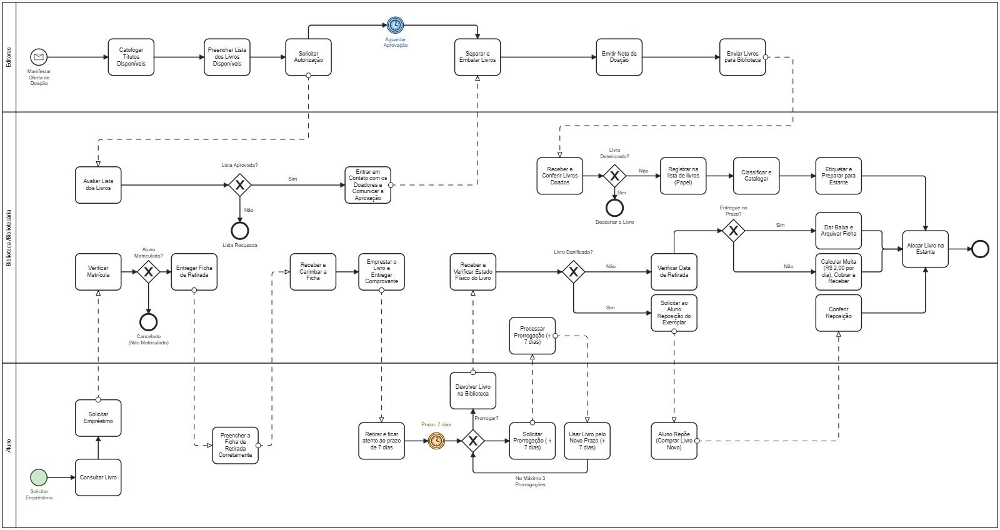

# 📚 Sistema de Empréstimo de Livros

## Sobre o projeto

Este projeto tem como objetivo organizar e melhorar o processo de empréstimo de livros da biblioteca da Escola São Bernardo (ESB), principalmente para os alunos dos cursos técnicos de Enfermagem e Farmácia.

Atualmente, algumas etapas do processo são realizadas de forma manual. Por isso, a ideia do projeto é entender como esse processo funciona, identificar suas principais etapas e pensar em uma forma de torná-lo mais organizado e fácil de acompanhar.

## 🔎 Como funciona o processo

O processo começa quando um aluno procura um livro na biblioteca e solicita o empréstimo. Primeiro, é verificado se o aluno está matriculado. Caso esteja, ele recebe uma ficha de retirada, que deve ser preenchida corretamente.

Depois disso, a biblioteca verifica a situação do livro e realiza o empréstimo, entregando o comprovante ao aluno.

O aluno deve ficar atento ao prazo de devolução, que inicialmente é de 7 dias. Caso precise de mais tempo, pode solicitar uma prorrogação. O processo permite até 3 prorrogações.

Quando o livro é devolvido, a biblioteca verifica suas condições. Se o livro estiver danificado, o aluno pode ser solicitado a repor o exemplar. Caso esteja em boas condições, a biblioteca verifica a data de devolução e, se houver atraso, calcula a multa correspondente.

Por fim, o livro é conferido e novamente colocado no estoque da biblioteca, ficando disponível para um próximo empréstimo.

## 📖 Entrada de novos livros

O processo também considera a chegada de livros por meio de doações.

Quando uma editora manifesta interesse em realizar uma doação, os títulos disponíveis são catalogados e uma lista é preparada para avaliação.

Depois da solicitação de autorização, a biblioteca aguarda a aprovação. Se a lista for aprovada, é feito o contato com os doadores e os livros são separados e embalados.

Em seguida, é emitida a nota de doação e os livros são enviados para a biblioteca.

Quando os livros chegam, eles são recebidos, conferidos, classificados e catalogados. Depois disso, são etiquetados e preparados para serem colocados no estoque.

## 🔄 Fluxo do processo

O processo completo pode ser visualizado no diagrama BPMN abaixo:

## 🎯 Objetivos

O projeto busca:

- Organizar o processo de empréstimo e devolução de livros;
- Facilitar o controle dos livros disponíveis;
- Registrar os empréstimos realizados;
- Controlar os prazos de devolução;
- Controlar possíveis atrasos e multas;
- Organizar a entrada de livros recebidos por doação;
- Tornar o processo da biblioteca mais claro e fácil de acompanhar.

## 📋 Documentação

Os documentos utilizados durante o desenvolvimento do projeto estão disponíveis neste repositório.

- [Escopo do projeto](./Escopo.docx)
- [Diagrama BPMN](./BPMN.jpg)

## 👥 Equipe

Enzo
Kaua Vinícius
João Pedro
Matheus
Mauro

### 📌 Status

🚧 Projeto em desenvolvimento
