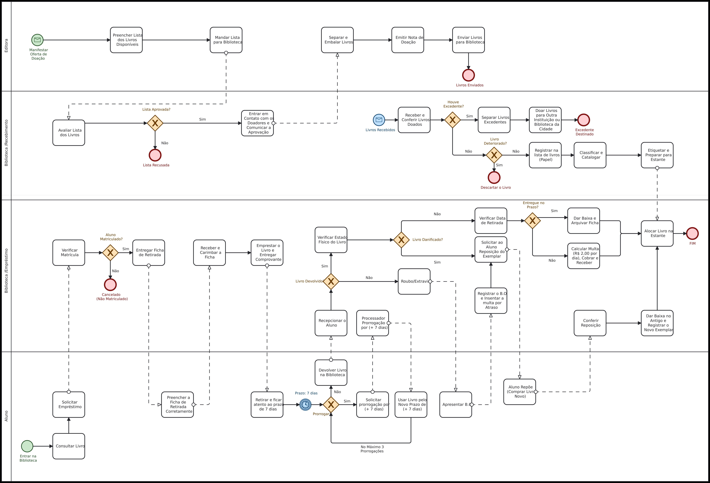

# 📚 Sistema de Gerenciamento de Biblioteca - ESB

  
  
  

**Sistema desenvolvido para planejar, organizar e otimizar os processos de empréstimo, devolução e incorporação de novos livros na biblioteca da Escola São Bernardo (ESB).**

---

## 📖 Sobre o Projeto

<b>Clique para expandir os detalhes do objetivo do projeto</b>

 

Este projeto tem como objetivo principal mapear, organizar e modernizar o fluxo de gerenciamento da biblioteca da **Escola São Bernardo (ESB)**, com foco especial no atendimento aos alunos dos cursos técnicos de **Enfermagem** e **Farmácia**.

Atualmente, grande parte das etapas operacionais é realizada de forma manual. Diante disso, a proposta visa analisar o funcionamento atual, identificar gargalos e desenhar processos mais claros, ágeis e rastreáveis por meio de modelagem de processos (BPMN) e documentação estruturada.

---

## ⚙️ Tecnologias e Ferramentas Utilizadas

As seguintes ferramentas e abordagens foram empregadas no desenvolvimento da documentação e modelagem:

* **Modelagem de Processos:** BPMN (Business Process Model and Notation)
* **Documentação:** Microsoft Word / Markdown
* **Controle de Versão:** Git e GitHub

---

## 🔎 Como Funciona o Processo

O fluxo operacional do sistema divide-se em três grandes pilares: **Empréstimo**, **Devolução** e **Entrada de Novos Livros**.

### 📚 1. Empréstimo de Livros

O fluxo de retirada ocorre nas seguintes etapas:
1. O aluno pesquisa e localiza o livro desejado na biblioteca.
2. A equipe realiza a verificação da regularidade da matrícula do aluno.
3. Estando apto, o aluno recebe e preenche a ficha de retirada.
4. O atendente valida a integridade e disponibilidade do livro.
5. O empréstimo é efetivado no sistema/controle e o comprovante é entregue ao aluno.

### ⏰ 2. Devolução de Livros

* **Prazo padrão:** 7 dias corridos.
* **Prorrogações:** É permitida a renovação por até **3 vezes**, caso não haja reservas pendentes.
* **Fluxo de devolução:**
  * 📕 **Inspeção física:** A condição do livro é verificada.
  * ⚠️ **Danos:** Caso o exemplar esteja danificado, o aluno poderá ser acionado para reposição.
  * 📅 **Prazos:** A data de entrega é conferida em relação ao limite estipulado.
  * 💰 **Multas:** Em caso de atraso, o valor correspondente é calculado.
  * 📚 **Retorno ao estoque:** Após a conferência final, o livro é disponibilizado novamente para empréstimo.

---

## 📦 Entrada de Novos Livros (Doações)

O fluxo também contempla a ampliação do acervo por meio de doações (parcerias com editoras ou doadores):

1. 📋 Catalogação inicial dos títulos disponibilizados.
2. 📝 Preparação e envio da lista para avaliação interna.
3. 📩 Solicitação de autorização formal.
4. 🤝 Contato com os doadores após a aprovação.
5. 📦 Separação, embalagem e emissão da nota de doação.
6. 🚚 Envio, recebimento e conferência física na biblioteca.
7. 📚 Classificação, catalogação definitiva, etiquetagem e entrada oficial no estoque.

---

## 🔄 Fluxo do Processo (BPMN)

A modelagem completa do fluxo de trabalho pode ser visualizada no diagrama **BPMN** abaixo:

---

## 🎯 Objetivos do Projeto

* 📚 **Organização:** Padronizar os fluxos de empréstimo, devolução e renovação.
* 📦 **Controle de Estoque:** Manter inventário e disponibilidade dos livros atualizados.
* 📝 **Rastreabilidade:** Registrar com precisão histórico de empréstimos e usuários.
* 📅 **Gestão de Prazos:** Monitorar datas de devolução de forma automatizada/controlada.
* 💰 **Gestão de Penalidades:** Controlar atrasos e cálculo de multas aplicáveis.
* 📥 **Expansão de Acervo:** Estruturar a entrada e catalogação de livros recebidos por doação.

---

## 📋 Documentação e Arquivos

Todos os artefatos desenvolvidos durante o projeto estão centralizados neste repositório:

* 📄 **[Documentação Completa do Projeto (Escopo)](./Escopo.docx)**
* 🔄 **[Diagrama BPMN em Alta Resolução](./BPMN.jpeg)**

---

## 👥 Equipe de Desenvolvimento

| Integrante | Função / Contribuição |
| :--- | :--- |
| **Enzo Alexandrino** | Desenvolvedor / Analista |
| **Kauã Vinícius** | Desenvolvedor / Analista |
| **João Pedro** | Desenvolvedor / Analista |
| **Matheus Duque** | Desenvolvedor / Analista |
| **Mauro Sena** | Desenvolvedor / Analista |

---

## 📌 Status do Projeto

### 🚧 Em Desenvolvimento (Fase de Modelagem e Escopo) 🚧

